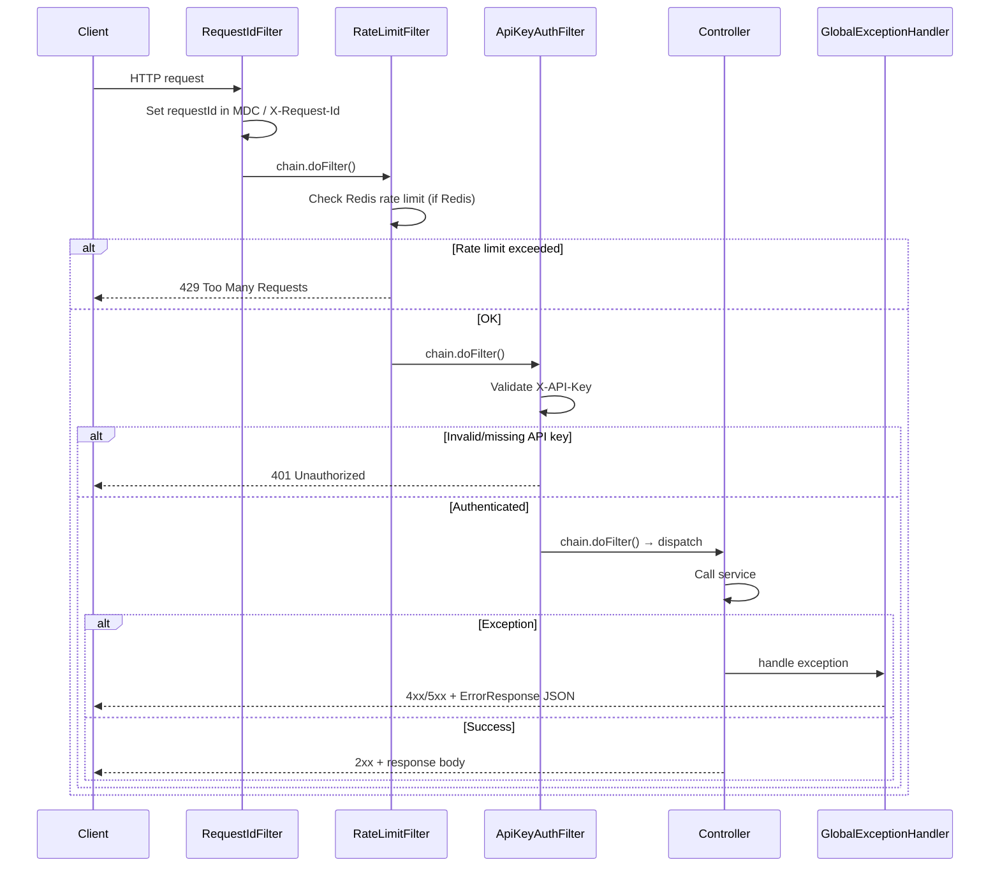
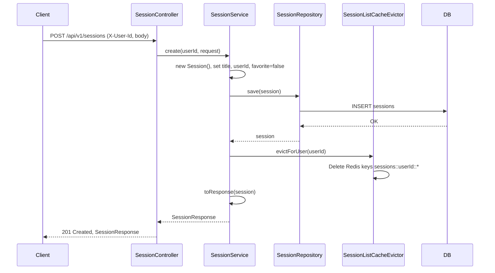
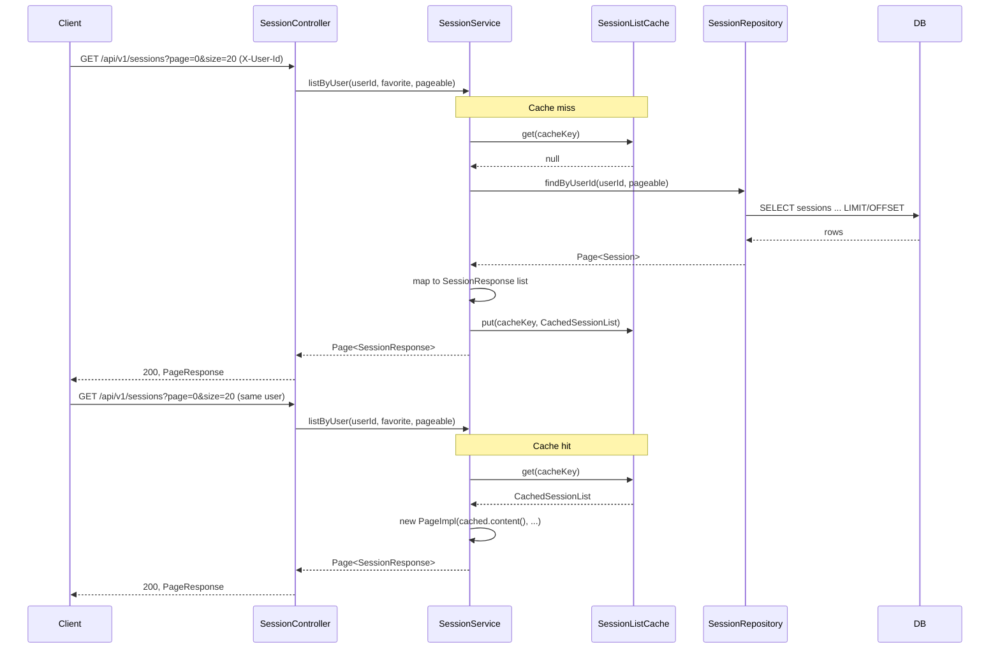
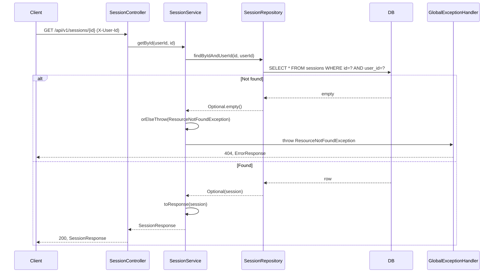
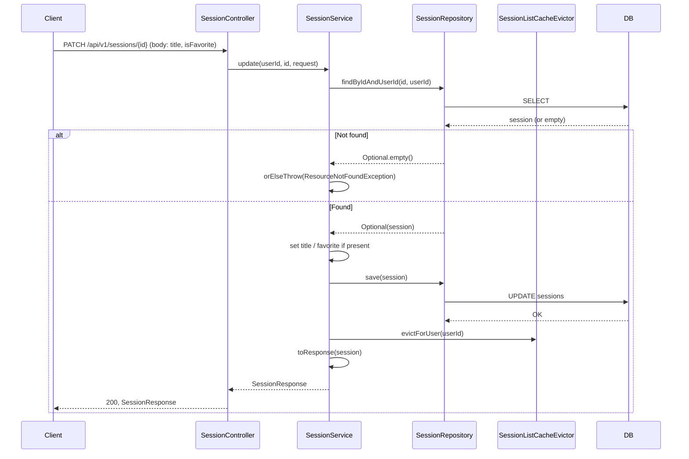
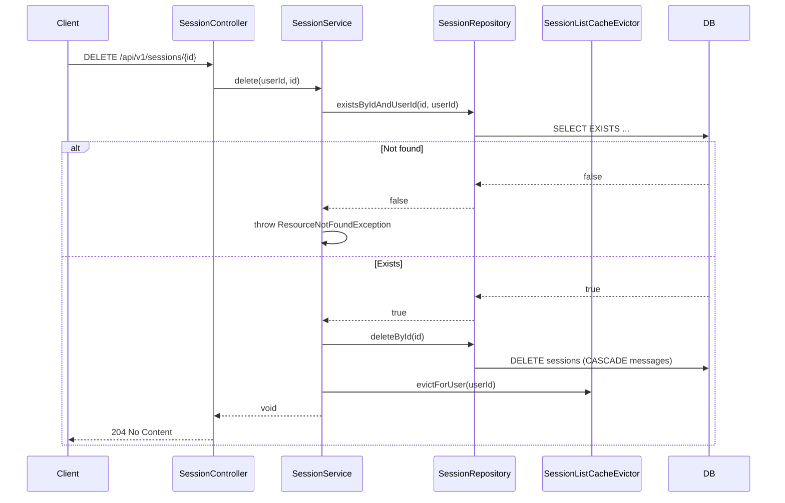
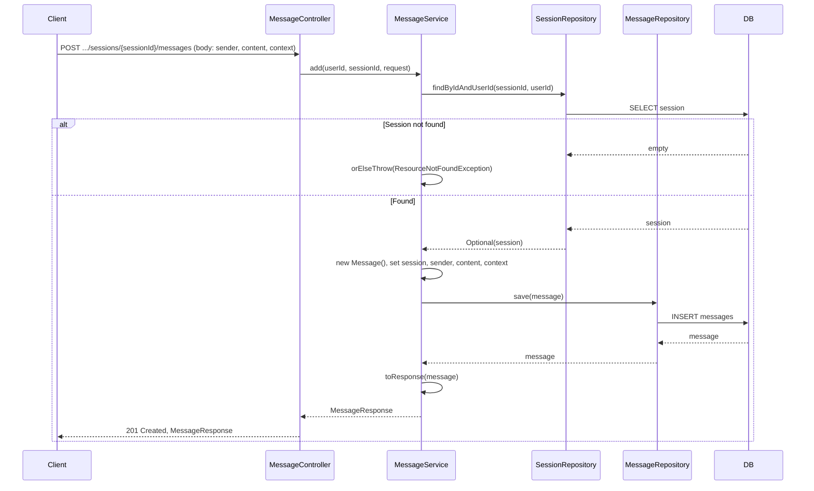
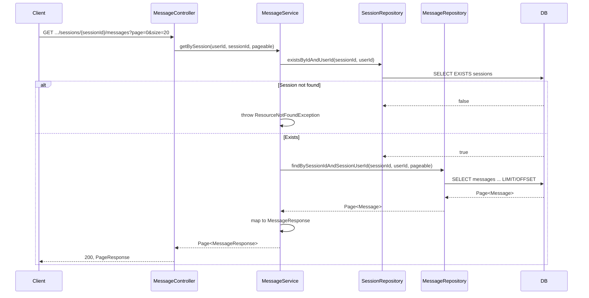
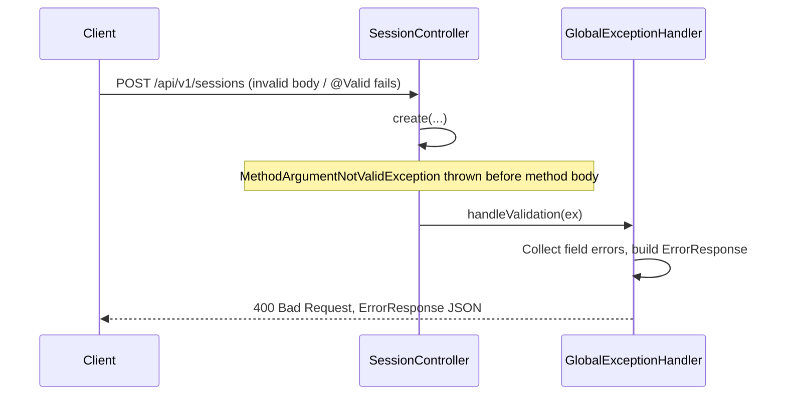

# RAG Chat Storage — Sequence Diagrams

Mermaid sequence diagrams for the main API flows. They render in GitHub, GitLab, VS Code (with a Mermaid extension), and many Markdown viewers.

---

## 1. Request pipeline (filters → controller)

Every `/api/v1/*` request passes through filters, then the controller.

---

## 2. Create session (POST /api/v1/sessions)

---

## 3. List sessions (GET /api/v1/sessions) — cache miss then hit

---

## 4. Get session by ID (GET /api/v1/sessions/{id})

---

## 5. Update session (PATCH /api/v1/sessions/{id})

---

## 6. Delete session (DELETE /api/v1/sessions/{id})

---

## 7. Add message (POST /api/v1/sessions/{sessionId}/messages)

---

## 8. List messages (GET /api/v1/sessions/{sessionId}/messages)

---

## 9. Validation error (e.g. invalid request body)

---

## How to view

- **GitHub / GitLab:** Open this file in the repo; Mermaid blocks render as diagrams.
- **VS Code:** Install "Markdown Preview Mermaid Support" or "Mermaid" extension, then preview the `.md` file.
- **Online:** Paste a diagram block into [mermaid.live](https://mermaid.live) to edit or export as PNG/SVG.
